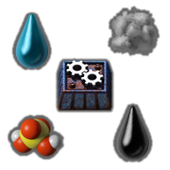

# 💧 `zzzYAIM0425 0500 free fluids` 

This MOD, `zzzYAIM0425-0500-free-fluids`, adds recipes to **generate and destroy fluids** found in nature in the game Factorio.

> 🧩 This MOD is part of the [zzzYAIM0425 series](https://github.com/yaim0425), designed to offer modular improvements and utilities that enhance the gameplay experience.

## 📦 Purpose

The main goal is to make natural fluids accessible for creative mode, testing environments, or customized scenarios.

### Benefits

- Recipe to **generate natural fluids** endlessly  
- Recipe to **eliminate unwanted fluids**  
- Useful for testing, simulations, and automation setups  
- Compatible with any fluid production system  

## 🗃️ Contents

- Recipe for **fluid generation**  
- Recipe for **fluid destruction**  
- Compatible with **other MODs** that use similar fluids  
- Built upon the shared structures of the `zzzYAIM0425` series  
- All its content is available to anyone who needs it; I'm open to changes, fixes, and suggestions.

.png)  
.png)
.png)
.png)
